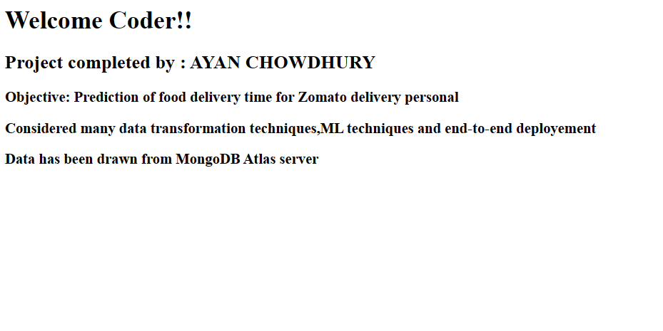
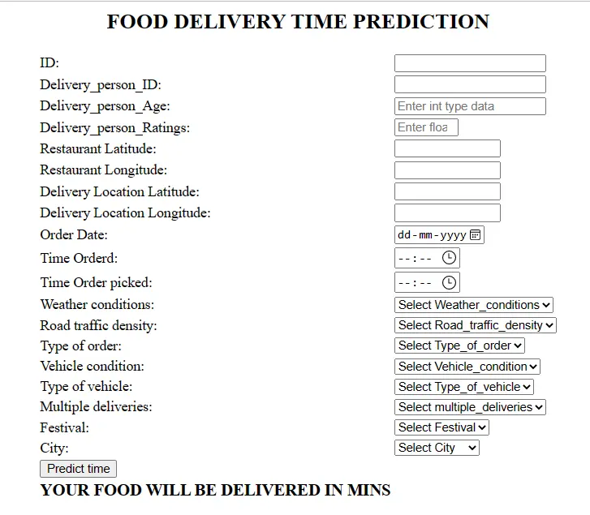

## This is the dataset for Zomato food delivery time ##
## Steps performed: ##
## 1. Virtual Env and setup.py with library requirements ##
## 2. EDA in jupyter notebook and chalk out the future mode building ##
## 3. Data_Ingestion.py: Build necessary codes for data ingestion from database ##
## 4. Data_Transformation.py: Transforms the data by imputing , labelling and scalling the data and injestion of these in pipeline. Performing column transformer for Model training.We create a preprocessor.pkl file for future use in prediction pipeline ##
## 5. Model_Trainer.py: Training the model through series of ML models and finding out the model with best accuracy. We create the model.pkl file for prediction. ##
## 6. Training Pipeline and Prediction pipeline: Pass the external data through .pkl files to get prediction of time required to deliver the food. ## 
## 7. app.py and templates: Create a api for getting the data through a form in html and pushing to prediction pipeline for calculation.
## 8. Dockerfile: Create a docker file and build an image which can be used as CI/CD integration with AWS or Azure. 
## 9. Check Github for git actions for any change and deployment in any cloud platform. ##

